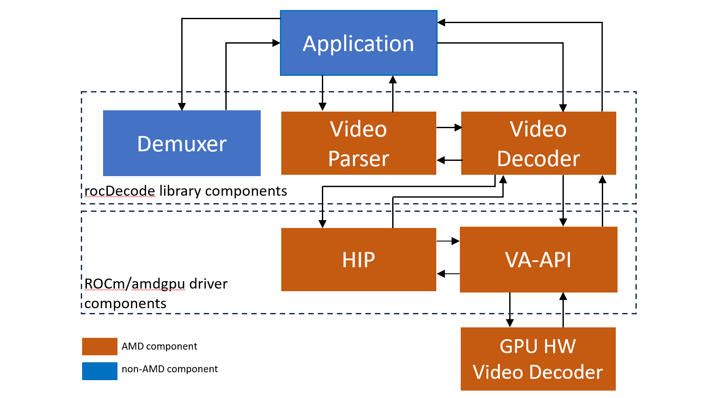

<head>
  <meta charset="UTF-8">
  <meta name="description" content="Video decoding pipeline">
  <meta name="keywords" content="video decoder, video decoding, rocDecode, AMD, ROCm">
</head>

# Video decoding pipeline

There are three main components in rocDecode:

* Demuxer: Our demuxer is based on FFmpeg, a leading multimedia framework. For more information,
  refer to the [FFmpeg website](https://ffmpeg.org/about.html).
* Video parser APIs
* Video decode APIs



rocDecode follows this workflow:

1. The demuxer extracts a segment of video data and sends it to the video parser.
2. The video parser extracts crucial information, such as picture and slice parameters, and sends it to
   the decoder APIs.
3. The hardware receives the picture and slice parameters, then decodes a frame using Video
   Acceleration API (VA-API).
4. This process repeats in a loop until all frames have been decoded.

Steps in decoding video content for applications (available in the rocDecode Toolkit):

1. Demultiplex the content into elementary stream packets (FFmpeg)
2. Parse the demultiplexed packets into video frames for the decoder provided by rocDecode API.
3. Decode compressed video frames into YUV frames using rocDecode API.
4. Wait for the decoding to finish.
5. Get the decoded YUV frame from amd-gpu context to HIP (using VAAPI-HIP interoperability under
   ROCm).
6. Run HIP kernels in the mapped YUV frame. For example, format conversion, scaling, object detection,
   classification, and others.
7. Release the decoded frame.

```{note}
YUV is a color space that represents images using luminance (Y) for brightness and two chrominance
components (U and V) for color information.
```

The preceding steps are demonstrated in the sample applications located in our
[GitHub repository](https://github.com/ROCm/rocDecode/tree/develop/samples) directory.
