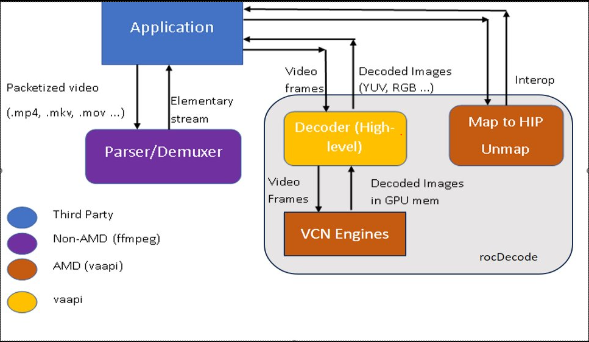

# rocDecode User Guide

## Contents

#### Chapter 1 Overview
1.1 Supported Codecs
#### Chapter 2 Decoder Capabalities
#### Chapter 3 Decoder Pipeline
#### Chapter 4 Using rocDecode API
4.1 Video Parser \
4.2 Querying decode capabilities \
4.3 Creating a Decoder \
4.4 Decoding the frame \
4.5 Preparing the decoded frame for further processing \
4.6 Getting data buffer \
4.7 Querying the decoding status \
4.8 Reconfiguring the decoder \
4.9 Destroying the decoder
#### Chapter 5 Samples
5.1 Video Decode \
5.2 Video Decode Performance \
5.3 Video Decode Fork \
5.4 Video Decode Memory \
5.5 Video Decode Multiple Files \
5.6 Video Decode RGB

## Chapter 1 Overview
AMD GPUs contain one or more hardware decoders as separate engines (VCNs) that provide fully accelerated hardware based video decoding. Hardware decoders consume lower power than CPU based decoders. Dedicated hardware decoders offload decoding tasks from CPU, boosting overall decoding throughput. And with proper power management, decoding on hardware decoders can lower the overall system power consumption.

This document describes AMDs rocDecode SDK which provides APIs, allowing the developers to access the video decoding features of VCNs and allows interoperability with other compute engines on the GPU. rocDecode API facilitates decoding of the compressed video streams and keeps the resulting YUV frames in video memory. With decoded frames in video memory, video post processing can 
be done using ROCm HIP, thereby avoiding unnecessary data copies via PCIe bus. The video frames can further be post-processed using scaling/color-conversion and augmentation kernels (on GPU or host) and be in a format for GPU/CPU accelerated inferencing/training.

In addition, rocDecode API can be used to create multiple instances of video decoder based on the number of available VCN engines in a GPU. By configuring the decoder for a device, all the available engines can be used seamlessly for decoding a batch of video streams in parallel.

### 1.1 Supported Codecs
The codecs currently supported by rocDecode are:
* HEVC/H.265 (8 bit and 10 bit)

Future versions of the SDK will support:
* H.264/AVC (8 bit)
* AV1

## Chapter 2 rocDecode Hardware Capabilities

Table 1 shows the codec support and capabilities of the VCN for each GPU architecture supported by rocDecode.

|GPU Architecture                    |VCN Generation | Number of VCNs |H.265/HEVC | Max width, Max height - H.265 | H.264/AVC | Max width, Max height - H.264 |
| :---                               | :---          | :---           | :---      | :---                          | :---      | :---                      |
| gfx908 - MI1xx                     | VCN 2.5.0     | 2              | Yes       | 4096, 2176                    | No        | 4096, 2160                |
| gfx90a - MI2xx                     | VCN 2.6.0     | 2              | Yes       | 4096, 2176                    | No        | 4096, 2160                |
| gfx940, gfx942 - MI3xx             | VCN 3.0       | 3              | Yes       | 7680, 4320                    | No        | 4096, 2176               |
| gfx941 - MI3xx                     | VCN 3.0       | 4              | Yes       | 7680, 4320                    | No        | 4096, 2176               |
| gfx1030, gfx1031, gfx1032 - Navi2x | VCN 3.x       | 2              | Yes       | 7680, 4320                    | No        | 4096, 2176               |
| gfx1100, gfx1102 - Navi3x          | VCN 4.0       | 2              | Yes       | 7680, 4320                    | No        | 4096, 2176               |
| gfx1101 - Navi3x                   | VCN 4.0       | 1              | Yes       | 7680, 4320                    | No        | 4096, 2176               |

Table 1: Hardware video decoder capabilities

## Chapter 3 Decoder Pipeline

There are three main components   in the rocDecode: Demuxer, Video Parser APIs, and Video Decode APIs.
The Demuxer is based on FFMPEG. The demuxer extracts a segment of video data and sends it to the Video Parser. The parser then extracts crucial information such as picture and slice parameters, which is then sent to the Decoder APIs. These APIs submit the information to the hardware for the decoding of a frame. This process repeats in a loop until all frames have been decoded.

Steps in decoding video content for applications (available in rocDecode Toolkit)

1. Demultiplex the content into elementary stream packets (FFmpeg)
2. Parse the demultiplexed packets into video frames for the decoder provided by rocDecode API.
3. Decode compressed video frames into YUV frames using rocDecode API.
4. Wait for the decoding to finish.
5. Map the decoded YUV frame from amd-gpu context to HIP (using VAAPI-HIP under ROCm)
6. Execute HIP kernels in the mapped YUV frame (e.g., format conversion, scaling, object detection, classification etc.)
7. Un-map decoded HIP YUV frame.

The above steps are demonstrated in the [sample applications](../samples/) included in the repository.

#### Chapter 4 Using rocDecode API

All rocDecode APIs are exposed in the two header files: `rocdecode.h` and `rocparser.h`. These headers can be found under `api` folder in this repository. \ The samples use the `RocVideoDecoder` user class provided in `roc_video_dec.h` under the `utils` folder in this repository.

